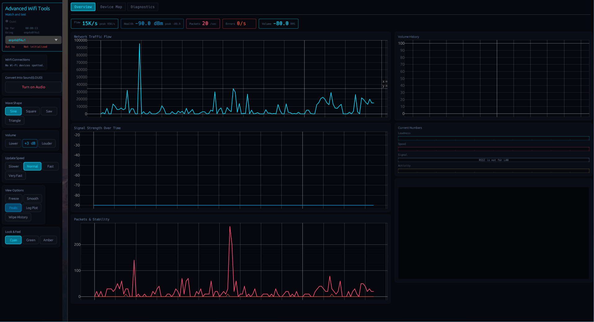

# AWSTT — Advanced WiFi Statistic and Testing Tool

> A Linux tool for analyzing, testing and visualizing WiFi performance in real time.  
> Provides advanced diagnostics and signal analysis.

---

## Features

| Feature | Description |
|---|---|
| **Advanced WiFi Statistics** | In-depth metrics and real-time data |
| **Connected Device Scanner** | Scan for nearby devices *(not so accurate yet)* |
| **Signal to Sound Mode** | Audible signal feedback |
| **Live Graphs & Analytics** | Visualize performance in real time |
| **Fast** | Built for speed |
| **Advanced Diagnostic Tool** | Deep diagnostics at your fingertips |

---

## Installation

### Download from Releases

1. Download the `.tar.gz` file from [Releases](../../releases)
2. Extract it:

```bash
tar -xzf [The tar.gz from releases]
cd AWSTT
cargo run
```

---

### Build from Source

```bash
git clone https://github.com/TonSHd/AWSTT.git
cd AWSTT
cargo run
```

---

## Preview



---

**Some tests depend on the network interface type. Certain features may only work on wireless interfaces or wired interfaces. For example, RSSI measurements are only available on wireless interfaces.**

## 💛 Support 💛

Made with passion for networking and open technology.

If you enjoy AWSTT and would like to support its development, you can donate:

**Bitcoin (BTC)**
```
bc1qz6v0tl48hpv075l0u3lww7mj4dj5xarjtkwa2x
```

> Donations are optional and do not unlock features.  
> **AWSTT will always remain free and open.**

Thank you and enjoy!
